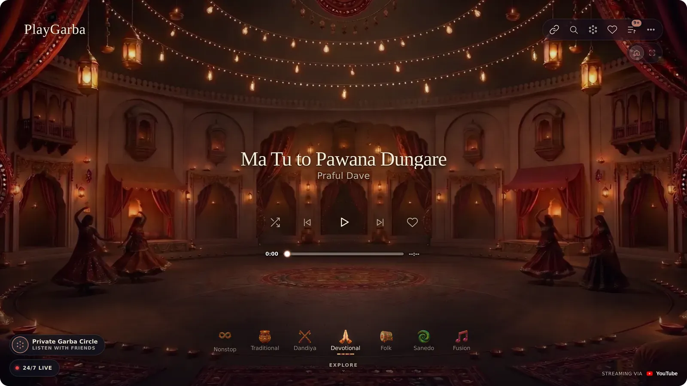
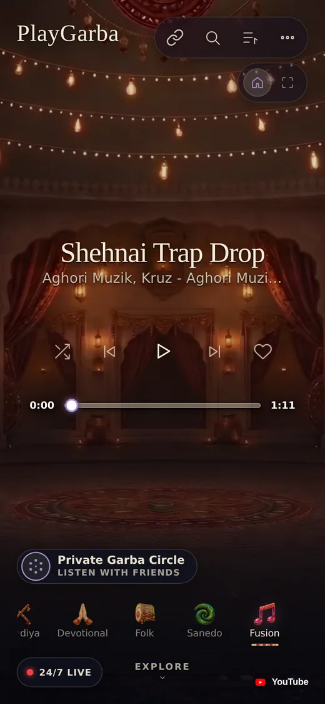
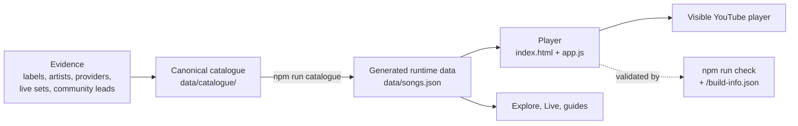

<div align="center">

# PlayGarba

**All the Garba in the world, in one place, free for everyone.**

A source-first catalogue of Garba music and a listening app built on it. Albums, cassettes, nonstop sets, live Navratri nights and chapters of long recordings, sorted properly and playable in one tap.

[**Open playgarba.com**](https://playgarba.com/) · [Explore the catalogue](https://playgarba.com/explore/) · [Add a missing song](https://github.com/ruddvz/garba/issues/new/choose) · [Documentation](docs/README.md)

[](LICENSE)
[](docs/project/licensing.md)
[](docs/product/responsive-pwa.md)
[](CONTRIBUTING.md)

<br>



</div>

---

## Why this exists

Garba music is everywhere, and almost none of it is in one place. It is spread across old albums and cassettes, CDs, streaming releases, live Navratri performances, three-hour nonstop sets, community uploads, artist pages, labels and local archives. Titles are spelled five ways. Live sets have no track lists. Good recordings sit next to the wrong ones.

PlayGarba fixes that in two parts:

1. **A careful catalogue.** Every song, release and live set is recorded from evidence. Missing dates, credits and durations stay blank until a source fills them.
2. **A listening app worth opening.** Fast, installable and good-looking on a phone in the middle of a garba ground, with no account and no paywall.

It is free, it has no ads of its own, and it is open source so it can stay that way.

## What you can do on it

| | |
| --- | --- |
| **Play by world** | Tap Traditional, Dandiya, Devotional, Folk, Sanedo or Fusion and a song starts straight away. |
| **Nonstop Garba** | Long sets and nonstop albums are first-class, with chapters where the source publishes them. |
| **24/7 Live** | Garba radio that is always on. Everyone tuned in hears the same song. |
| **Private Garba Circle** | Share a link or QR code and a whole group hears the same song at the same moment, each on their own phone. No server, no sign-up. |
| **Explore** | Browse by genre, artist and release, search, and see which songs are playable first. |
| **Your own songs** | Keep favourites, build Up next, and add YouTube links of your own. |
| **Simple and Immersive** | The Simple player keeps the palace courtyard. Immersive puts you in a full venue scene. |
| **Install it** | Add it to your home screen like an app, on Android, iPhone or desktop. |

<p align="center">
  
</p>

## Music coverage

The player presents six visual worlds:

| Player world | Music represented |
| --- | --- |
| **Traditional** | Traditional Garba, roots/archive material, Tran Taali, Be Taali and related forms |
| **Dandiya** | Raas, Dandiya and related dance traditions |
| **Devotional** | Mataji, Krishna Garba, devotional Raas and temple-oriented material |
| **Folk** | Gujarati folk, lokgeet, Hinch, Dakla and related traditions |
| **Sanedo** | Sanedo and high-energy community/festival material |
| **Fusion** | Modern Gujarati Garba, electronic, hip-hop, remix, cinematic and crossover material |

These are presentation worlds. The canonical taxonomy is more detailed and lives in `data/taxonomy.json`.

The catalogue holds more than 1,700 songs across more than 240 releases and keeps growing. For the exact deployed revision and current counts, use [`/build-info.json`](https://playgarba.com/build-info.json). For definitions, source layout and dated history, see [`docs/catalogue/status.md`](docs/catalogue/status.md).

## Principles

- **Source first.** Unknown dates, durations, credits and rights stay unknown until evidence supports them. A blank field is more useful than confident-looking fiction.
- **No piracy.** Commercial audio is never copied into this repository just because it is available elsewhere.
- **Evidence is not canon.** A Reddit tip, playlist or community upload can be useful evidence without automatically becoming release metadata.
- **Long-form Garba matters.** Live performances, nonstop albums and timestamped chapters are discovery objects in their own right, not edge cases.
- **The live site matches the source.** The player, generated catalogue, service worker and deployed build identity are validated so production cannot silently drift.

## Playback and rights

PlayGarba is a discovery and listening project, not an audio mirror.

Executable music playback is YouTube-only:

- exact verified YouTube recordings and directly verified timestamped chapters play through the visible YouTube IFrame player;
- Apple Music, Spotify, Amazon Music, SoundCloud, Bandcamp, Qobuz and direct-audio records may remain as source/provenance evidence, but they do not become executable fallbacks;
- unchaptered multi-song YouTube releases, provider reference pages and ambiguous same-title recordings stay non-executable until the exact recording is verified;
- PlayGarba does not extract raw streams, hide the YouTube player, suppress YouTube advertising or cache YouTube media for offline playback.

Artists and labels get the view, the credit and the ad revenue. The playback contract is in [`docs/product/youtube-first-playback.md`](docs/product/youtube-first-playback.md). Rights and provenance policy is in [`docs/catalogue/rights.md`](docs/catalogue/rights.md).

## How it fits together



<details>
<summary><b>Repository layout</b></summary>

```text
garba/
├── index.html                  # production player entry point
├── app.js                      # production app/controller source
├── simple-runtime.js           # launch-safe runtime layer
├── provider-runtime.js         # YouTube-only execution policy
├── player-continuity.js        # selection/route continuity safeguards
├── youtube-player-runtime.js   # visible YouTube IFrame controller
├── nonstop-browser.js          # production Nonstop Garba browser
├── sw.js                       # production service worker
│
├── styles/                     # ordered, purpose-named CSS source layers
├── src/
│   └── optional/               # retained browser experiments, not shipped by Pages
├── assets/
│   ├── backgrounds/            # production artwork packs and world assets
│   └── icons/                  # app/PWA icons
├── data/
│   ├── catalogue/              # canonical source shards and manifest
│   ├── discovery/              # artists, recommendations and live/nonstop sets
│   ├── rights-acquisition/     # rights operations data
│   └── README.md               # source vs generated-data contract
├── docs/
│   ├── catalogue/              # schema, status, sources and catalogue rights
│   ├── product/                # design, playback, responsive/PWA and UX notes
│   ├── rights/                 # partnership and licensing operations
│   ├── operations/             # hosting, ingestion and publishing procedures
│   ├── project/                # roadmap and licensing
│   └── README.md               # canonical documentation index
├── scripts/                    # catalogue, validation and operations tooling
└── .github/                    # issues and CI/Pages workflows
```

The root is intentionally small. A browser file lives there only if it is part of the production runtime or a standard repository entry point.

GitHub Pages builds one production artifact at `playgarba.com`. Production `app.js` and `styles.css` are assembled from several source layers, so source-file byte differences alone are not proof that production is stale. The deployed `/build-info.json` records the exact Git revision and SHA-256 digests for key assembled files.

</details>

<details>
<summary><b>Catalogue layout</b></summary>

Canonical catalogue shards are listed explicitly in `data/catalogue/index.json`. That manifest controls what the build consumes.

```text
data/catalogue/
├── index.json
├── songs/
├── releases/
├── free-sources/
└── archive/                    # retained but deliberately unindexed fragments
```

Existing numbered shards are append-only. Renumbering old shards to make the sequence look tidy would create noisy history and contributor conflicts. New semantic shards take the next sequence number and a descriptive suffix.

Generated aggregate files are rebuilt through the project scripts, never edited as competing sources of truth.

</details>

## Run it locally

```bash
git clone https://github.com/ruddvz/garba.git
cd garba
npm run check
npm run serve
```

Then open `http://localhost:4173`. No install step and no framework: it is plain HTML, CSS and JavaScript with Node scripts for the catalogue build.

`npm run check` rebuilds the catalogue and validates runtime/data contracts, YouTube route truth, repository structure, documentation and the build-identity contract. PWA installation needs HTTPS or a browser-recognised local origin.

## Contributing

You do not need to write code to help. The most useful contributions are often:

- a missing song, album, live set or nonstop programme;
- an old track list, or timestamps for a long recording;
- a regional artist who is not in the catalogue yet;
- a spelling, transliteration or classification correction;
- an official source that confirms or corrects a record;
- a player bug, accessibility fix or performance improvement.

Start with [`CONTRIBUTING.md`](CONTRIBUTING.md), or [open an issue](https://github.com/ruddvz/garba/issues/new/choose) with what you know and where you found it.

The one hard rule: **do not guess catalogue facts, and do not upload music you do not have the right to redistribute.**

## Licence: free, and staying free

PlayGarba was made to be free for everyone. The licence is not there to make anything harder. It is there so the work stays open and nobody can close it off or pass it off as their own.

| Part | Licence |
| --- | --- |
| Code | [GNU AGPL-3.0-only](LICENSE) |
| Catalogue data, docs, editorial text | [CC BY-SA 4.0](https://creativecommons.org/licenses/by-sa/4.0/) |
| PlayGarba name, wordmark, icons, Garbo mark | Reserved, see [`TRADEMARKS.md`](TRADEMARKS.md) |
| Music, recordings, album art, YouTube videos | Owned by their rights holders |

**You can** use it, study it, fork it, change it, host it and build on the data, at no cost and without asking.

**If you share or host a changed version**, keep it open under the same licence, keep the credit in [`NOTICE`](NOTICE) (`Based on PlayGarba`, with a link here), say that it is changed, and give it your own name.

Plain-language details, including what this means for contributors, are in [`docs/project/licensing.md`](docs/project/licensing.md). To cite PlayGarba in research or writing, use [`CITATION.cff`](CITATION.cff) or the "Cite this repository" button on GitHub.

---

<div align="center">

PlayGarba is still growing. If something is missing, keep the gap visible, find the evidence and add it carefully.

**[playgarba.com](https://playgarba.com/)**

</div>
